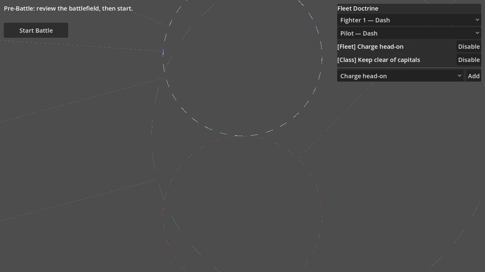

# Fleet Doctrine — player standing instructions

Football Manager-style tactical orders for the roguelike run: the
player manages at any altitude, from fleet-wide doctrine down to a
standing order for one named crew member, without ever touching
pattern JSON. Implements `DOCS/plans/06_crew_knowledge_and_training.md`
increments 2/2b on top of the
[tactical knowledge system](tactical_knowledge_system.md).



## Using it (player view)

Doctrine lives inside a roguelike run. The flow:

1. **Main Menu → Fleet Management → Launch** starts a run. This
   creates the crew roster: every hull gets named crew (callsigns
   like *Dash*, *Echo*) that persist across the whole run.
2. On the map, click a battle node — you land on the **pre-battle
   positioning screen**. The **Fleet Doctrine panel** sits on the
   right. (Outside a run, the same spot shows a hint instead; the
   direct main-menu "Pre-Battle" has no run and therefore no doctrine.)
3. The **ship dropdown is the scope selector**:
   - *Entire fleet* — orders for everyone
   - *All Fighters / All Corvettes / …* — orders for one ship class
   - *Fighter 1 — Dash* — one hull; its crew appear in the **crew
     dropdown**, and orders here are personal to the selected member.
   Clicking a ship on the map syncs the dropdown to that hull, and
   picking a hull in the dropdown selects it on the map. Crew are
   only ever addressed through the crew dropdown.
4. Pick an instruction from the **template dropdown** (parameter
   dropdowns appear when the template has options, e.g. *Keep clear
   of capitals/corvettes*) and press **Add**.
5. The instruction list shows the *effective* set with provenance:
   `[Fleet]`, `[Class]`, or `[Personal]`. The most specific scope
   wins when the same instruction appears at several scopes — the
   broader one shows `(overridden)`. On an individual, inherited
   orders carry a **Disable** button ("everyone keeps distance, but
   Dash may close"); orders at the edited scope carry **Remove**.
6. If the selected crew member can't execute an order yet, the row
   says so — `— can't execute yet (needs piloting +0.2)`. The order
   does nothing in battle until the skill gate is met (training,
   plan 06 increment 3, will hook in here).
7. Orders are committed when the battle starts and take effect for
   that battle. Doctrine is run state: it persists across battles
   within the run, is editable before every battle, and is wiped when
   the run ends. Nothing carries across runs.

## How it works

```
data/instruction_templates.json        RoguelikeRun.doctrine (run state)
        │  (catalog)                       │ fleet / classes / crew / disabled
        ▼                                  ▼
DoctrinePanel (pre-battle UI) ──edits──► DoctrineSystem
                                           │ compile_for_crew()  (battle spawn)
                                           ▼
                              crew.known_patterns  (player-priority patterns)
                                           │
                                           ▼
                       TacticalKnowledgeSystem.query_knowledge()  (unchanged)
```

### Template catalog — `data/instruction_templates.json`

Players pick from designer-authored templates; they never write BM25
keyword text. A template:

```json
"keep_clear_of": {
    "name": "Keep clear of {target_class}s",
    "description": "Break away rather than engage near this ship class.",
    "role": "pilot",
    "params": {
        "target_class": {"options": ["capital", "corvette"], "default": "capital"}
    },
    "pattern": {
        "tags": ["fighter", "{target_class}", "retreat", "evade", "close"],
        "text": "fighter {target_class} close mid range retreat evade danger escape keep distance",
        "content": {
            "context": "Standing order: keep clear of {target_class}s",
            "maneuvers": ["fight_evasive_retreat"],
            "skill_requirements": {"fight_evasive_retreat": 0.0}
        }
    }
}
```

- `role` — which crew role the order applies to (`pilot`, `gunner`,
  `captain`, `squadron_leader`, `fleet_commander`). Role filtering
  happens at compile: a pilot template never lands on a gunner.
- `params` — choice parameters; `{param}` tokens substitute into
  `tags`, `text`, and `content` at instantiation.
- `pattern` — a normal tactical pattern (see
  [tactical_knowledge_system.md](tactical_knowledge_system.md)).
  `text`/`tags` describe *when* the order applies (the situations it
  matches); `content` is *what* the crew member does there. A "charge
  head-on" order deliberately matches flanking situations — in those
  moments, charge instead.

**Adding a template is data work**: add an entry to the catalog and
it appears in the panel's dropdown. No code changes.

### Doctrine document — `RoguelikeRun.doctrine`

```gdscript
{
    "fleet":    {template_id: params},                  # everyone
    "classes":  {ship_type: {template_id: params}},     # one ship class
    "crew":     {crew_id: {template_id: params}},       # one crew member
    "disabled": {crew_id: [template_id, ...]}           # personal opt-outs
}
```

One instance per template per scope — re-adding replaces the params.
Edited in place via `DoctrineSystem.set_instruction_in_place` /
`remove_instruction_in_place` / `set_disabled_in_place` (one-owner
run state). Reset by `start_run()`, wiped by `end_run()`.

### Compilation — `DoctrineSystem.compile_for_crew()`

Runs once per crew member at battle spawn (team 0, roguelike only):

1. Strip previously compiled ids (prefix `doctrine__`) so orders
   removed between battles never linger; recompiling is idempotent.
2. Resolve `effective_instructions()`: walk fleet → class → crew
   layers, filter by role, mark broader duplicates `overridden`,
   apply the crew member's `disabled` list.
3. Instantiate each surviving template into a pattern and register it
   in the knowledge base as `doctrine__{crew_id}__{template_id}` with
   the `player_priority` flag.
4. Add the ids to the crew member's `known_patterns`. An empty set
   (= full role baseline) is first expanded to the explicit role
   doctrine ids — **excluding** other crew's player-priority patterns
   — so standing orders extend doctrine rather than replace it.

Retrieval is untouched: a *relevant* player pattern gets
`PLAYER_INSTRUCTION_SCORE_BONUS` and outranks role doctrine; an
irrelevant one scores zero and stays silent; baseline queries (enemy
crew) never see player patterns.

### Crew roster and hull binding

`RoguelikeRun.start_run()` builds the roster
(`_create_fleet_roster`): one crew group per hull, callsigns
assigned, skills at `ROSTER_SKILL_LEVEL`. Battle spawn *binds* groups
to hulls instead of creating crew: ships spawn in battle-plan entry
order and `take_saved_crew(ship_type)` pops the first remaining group
of that type, so the n-th entry of a type always gets the n-th group.
`DoctrineSystem.map_entries_to_crew_groups()` computes the same
mapping for the panel — that ordering contract is what makes
"Fighter 1 — Dash" in the dropdown the same pilot who flies that hull
in battle. Between battles, survivors are re-saved
(`update_fleet_after_battle`) and restored next spawn via
`CrewData.reset_for_battle` (identity, skills, `known_patterns`, and
command chain persist; per-battle state and stress/fatigue reset).

## Key files

| File | Role |
|---|---|
| `data/instruction_templates.json` | Template catalog (data-only extension point) |
| `scripts/space/systems/doctrine_system.gd` | Scopes, instantiation, compile, UI queries |
| `scripts/ui/pre_battle/doctrine_panel.gd` | Dropdown-driven editor on the positioning screen |
| `scripts/core/autoload/roguelike_run_autoload.gd` | Doctrine + roster run state |
| `scripts/space/systems/tactical_knowledge_system.gd` | Priority scoring, leak guard (unchanged engine) |
| `tests/test_doctrine_system.gd` | Scopes, overrides, disables, lifecycle, done-criterion |
| `tests/test_doctrine_panel.gd` | Dropdown behaviors |
| `tools/doctrine_screenshot_harness.tscn` | Visual verification (see below) |

## Verifying visually

```bash
xvfb-run -a -s "-screen 0 1600x900x24" godot --path . --resolution 1600x900 \
    res://tools/doctrine_screenshot_harness.tscn
```

The harness boots a run, opens the pre-battle screen, seeds a fleet
and a class order, selects a hull, and saves `/tmp/doctrine_panel.png`.

## What's next (plan 06)

- **Increment 3 — training**: spend a between-battle resource to add
  patterns, raise skills, or drill a maneuver's gate down. The
  panel's "can't execute yet" warning is the entry point.
- **Increment 4 — outcome feedback**: show per-instruction success /
  failure counts from `TacticalMemorySystem` in the panel so doctrine
  is tuned from evidence.
